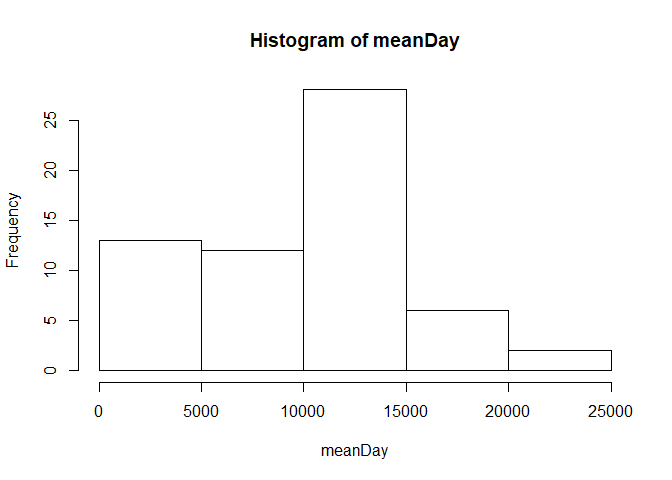
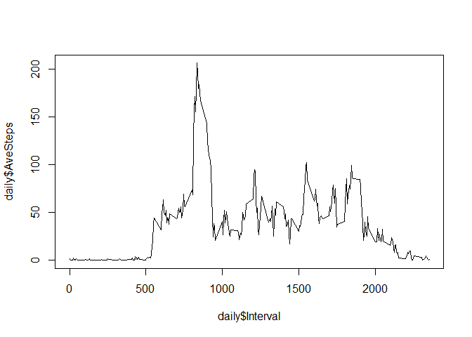
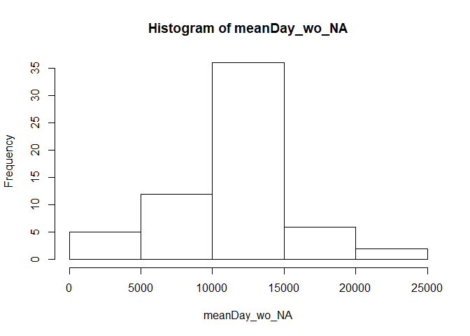
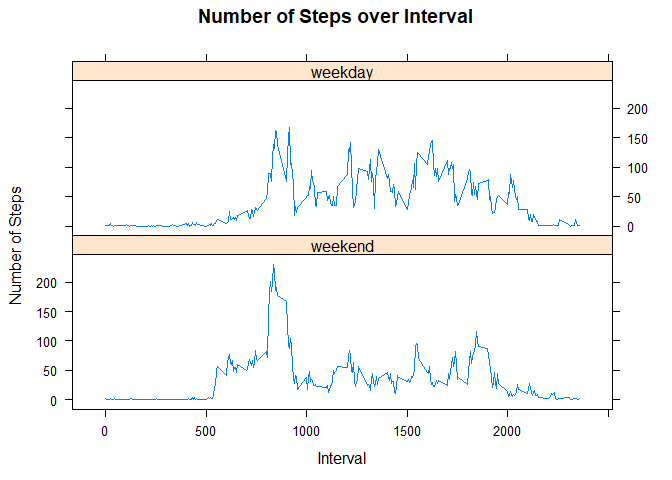

## Loading and preprocessing the data

```r
# Load knitr library
library(knitr)
# Unzip zipfile, acitivity.zip
unzip(zipfile = "activity.zip")
# Read activity.csv and save it as activity data frame
activity <- read.csv("activity.csv", header=T, stringsAsFactors = F)
# Transform the date column class date
activity <- transform(activity, date = as.Date(date))
```


## What is mean total number of steps taken per day?

```r
# Get sum of steps taken per day
meanDay <- tapply(activity$steps, activity$date, sum, na.rm=T)
# Print histogram of meanDay
hist(meanDay)
```

<!-- -->

```r
# Get mean and median of total number steps taken per day
mean <- summary(meanDay)[4]
median <- summary(meanDay)[3]
# Print the mean and median
print (mean)
```

```
##    Mean 
## 9354.23
```

```r
print (median)
```

```
## Median 
##  10395
```

## What is the average daily activity pattern?

```r
# Get the mean of steps taken for each interval
daily <- tapply(activity$steps, activity$interval, mean, na.rm=T)
# Convert the daily array to data frame
daily <- as.data.frame(as.table(daily))
# Name daily columns
colnames(daily) <- c("Interval", "AveSteps")
# Transform the interval class as numeric
daily <- transform(daily, Interval = as.numeric(as.character(Interval)))
# Plot a time series plot of the 5-min interval and average number of steps taken averaged across all days
plot(daily$AveSteps ~ daily$Interval, type="l")
```

<!-- -->

```r
# Get the Interval with maximum average number of steps
maxInterval <- daily[which.max(daily[,2]),1]
# Print out the maxInterval
print(maxInterval)
```

```
## [1] 835
```

## Imputing missing values

```r
# Calculate the total number of missing values
numNA <- sum(is.na(activity$steps))
# Print out numNA
print (numNA)
```

```
## [1] 2304
```

```r
# GetAveStep function that grabs aveage step with given interval
GetAveSteps <- function(x){
  daily[daily$Interval==as.numeric(x),2]
}
# Use GetAveStep function to fill all the missing values
imputeNA <- activity
imputeNA[is.na(imputeNA$steps),]$steps <- sapply(imputeNA[is.na(imputeNA$steps),]$interval, GetAveSteps)


# Get sum of steps taken per day using imputeNA
meanDay_wo_NA <- tapply(imputeNA$steps, imputeNA$date, sum, na.rm=T)
# Print histogram of meanDay
hist(meanDay_wo_NA)
```

<!-- -->

```r
# Get mean and median of total number steps taken per day
mean_wo_NA <- summary(meanDay_wo_NA)[4]
median_wo_NA <- summary(meanDay_wo_NA)[3]
# Print the mean and median
print (mean_wo_NA)
```

```
##     Mean 
## 10766.19
```

```r
print (median_wo_NA)
```

```
##   Median 
## 10766.19
```

## Are there differences in activity patterns between weekdays and weekends?

```r
# Import lubridate library
library(lubridate)
```

```
## 
## Attaching package: 'lubridate'
```

```
## The following object is masked from 'package:base':
## 
##     date
```

```r
# Create a day column in imputeNA dataframe
imputeNA$day <- wday(imputeNA$date,label=T)
# Indicate if the date is weekend or weekday
imputeNA$wdwk <- (imputeNA$day=="Sun" |imputeNA$day=="Sat")
imputeNA$wdwk <- factor(imputeNA$wdwk, labels=c("weekend", "weekday"))
# Aggregate imputeNA by the mean of steps
imputeMean <- with(imputeNA, aggregate(steps, list(interval = interval, wdwk = wdwk), mean))
# Import lattice library
library(lattice)
# Plot two panels for number of steps over interval: one for weekend and the other for weekday. 
with(imputeMean, xyplot(x~interval|wdwk, main="Number of Steps over Interval", ylab="Number of Steps", xlab="Interval", layout=c(1,2), type='l'))
```

<!-- -->
